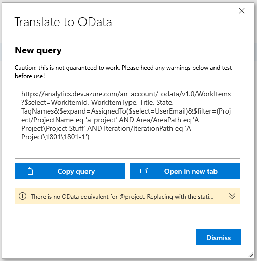

Wiql to OData translates an Azure DevOps query into an OData query for use with [Azure DevOps Analytics](https://marketplace.visualstudio.com/items?itemName=ms.vss-analytics) [OData endpoints](https://docs.microsoft.com/en-us/azure/devops/report/extend-analytics/?view=vsts).

## Features

- Convert 'flat list of work items' and 'work items and direct links' ADO queries to OData queries with the click of a button. These queries are url formatted and ready to be used in your apps with any http client.

## Restrictions

- You must have [Azure DevOps Analytics](https://marketplace.visualstudio.com/items?itemName=ms.vss-analytics) installed to your account.
- As with the Azure DevOps Analytics extension, *this extension is currently in preview*. It will not support some scenarios that OData or ADO Analytics currently doesn't support. For example...
    - Recursive (tree) Wiql queries are not supported.
    - Macros (such as `@project`, `@me`), are not supported. When possible, these values will be replaced with static values. `@today` is supported, but mathematical operations on `@today` such as `@today - 1` are not supported, and will be replaced with a static value.
- The output query is a best guess, and may require some adjustment to perform exactly as required. Please heed the warnings listed below the query text.

## Reporting Security Issues

Security issues and bugs should be reported privately, via email, to the Microsoft Security
Response Center (MSRC) at [secure@microsoft.com](mailto:secure@microsoft.com). You should
receive a response within 24 hours. If for some reason you do not, please follow up via
email to ensure we received your original message. Further information, including the
[MSRC PGP](https://technet.microsoft.com/en-us/security/dn606155) key, can be found in
the [Security TechCenter](https://technet.microsoft.com/en-us/security/default).

## Contributing

This project welcomes contributions and suggestions.  Most contributions require you to agree to a
Contributor License Agreement (CLA) declaring that you have the right to, and actually do, grant us
the rights to use your contribution. For details, visit https://cla.microsoft.com.

When you submit a pull request, a CLA-bot will automatically determine whether you need to provide
a CLA and decorate the PR appropriately (e.g., label, comment). Simply follow the instructions
provided by the bot. You will only need to do this once across all repos using our CLA.

This project has adopted the [Microsoft Open Source Code of Conduct](https://opensource.microsoft.com/codeofconduct/).
For more information see the [Code of Conduct FAQ](https://opensource.microsoft.com/codeofconduct/faq/) or
contact [opencode@microsoft.com](mailto:opencode@microsoft.com) with any additional questions or comments.
